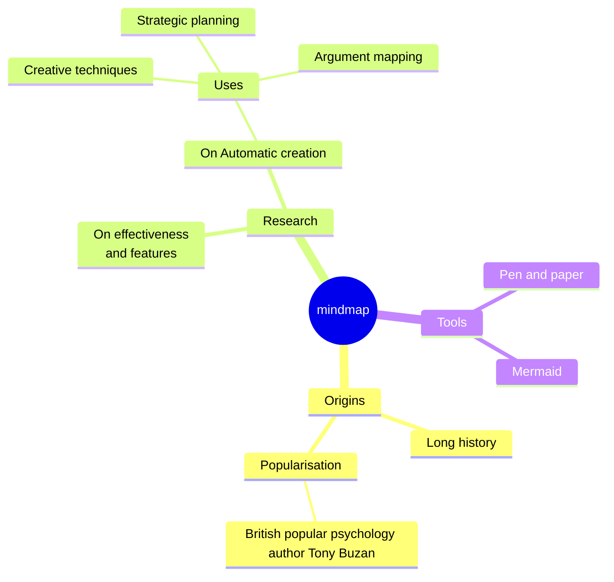

# 概览

## 模板列表

- [多项选择](/zh/templates/classic/mcq)
- [正误题](/zh/templates/classic/tf)
- [基础问答](/zh/templates/classic/basic)
- [匹配](/zh/templates/classic/match)
- [填空](/zh/templates/classic/cloze)
- [输入题](/zh/templates/classic/input)
- [多项选择（10 选项）](/zh/templates/classic/mcq_10)
- [多项选择（26 选项）](/zh/templates/classic/mcq_26)

## 模板内嵌配置（Embedding Options）

由于 Anki 不支持在模板内存储数据，模板的偏好设置会存在以下问题：

- 无法在多设备间同步
- 某些客户端重启后偏好可能丢失

解决方法：将设置页里格式化后的模板配置粘贴到模板代码中，对应步骤：

1. 打开 Anki 卡片模板设置（不同平台入口不同，请参考官方文档）。
2. 在该模板的「Front Template」中，粘贴设置页面中显示的已格式化配置到对应位置。


<a id="markdown-support"></a>

## Markdown 支持

模板的 Markdown 由 ByteMD 提供。如需实时预览编辑效果，可直接使用 ByteMD 的 playground。

但请注意，模板中并未启用 playground 里全部插件，具体启用列表请参考模板的 markdown 渲染实现。

下面是可用语法与示例。

### Markdown 基础语法


````markdown
I just love **bold text**. Italicized text is the _cat's meow_. At the command prompt, type `nano`.

My favorite markdown editor is [ByteMD](https://github.com/bytedance/bytemd).

1. First item
2. Second item
3. Third item

> Dorothy followed her through many of the beautiful rooms in her castle.

```js
import gfm from '@bytemd/plugin-gfm';
import { Editor, Viewer } from 'bytemd';

const plugins = [
  gfm(),
  // Add more plugins here
];

const editor = new Editor({
  target: document.body, // DOM to render
  props: {
    value: '',
    plugins,
  },
});

editor.on('change', (e) => {
  editor.$set({ value: e.detail.value });
});
```
````

### GFM 扩展语法


```markdown
Automatic URL Linking: https://github.com/bytedance/bytemd

~~The world is flat.~~ We now know that the world is round.

- [x] Write the press release
- [ ] Update the website
- [ ] Contact the media

| Syntax    | Description |
| --------- | ----------- |
| Header    | Title       |
| Paragraph | Text        |
```

### 数学公式


```markdown
Inline math equation: $a+b$

$$
\displaystyle \left( \sum_{k=1}^n a_k b_k \right)^2 \leq \left( \sum_{k=1}^n a_k^2 \right) \left( \sum_{k=1}^n b_k^2 \right)
$$
```

### Mermaid 图表


````markdown

````
