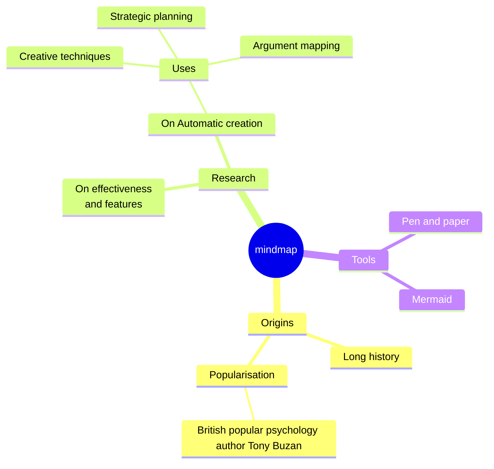

# Markdown support
The markdown format of the template is supported through [ByteMD](https://github.com/pd4d10/bytemd). Therefore, if you want to preview it in real time while editing, you can use ByteMD's [playground](https://bytemd.js.org/playground/) directly.

However, please note that not all plugins available in the playground are enabled in the template. For the specific list of enabled plugins, please refer to [this link](https://github.com/ikkz/anki-template/blob/main/src/features/markdown/renderer.tsx#L20-L26).

Below are some of the available formats and render results.

## Markdown Basic Syntax


```markdown
I just love **bold text**. Italicized text is the _cat's meow_. At the command prompt, type `nano`.

My favorite markdown editor is [ByteMD](https://github.com/bytedance/bytemd).

1. First item
2. Second item
3. Third item

> Dorothy followed her through many of the beautiful rooms in her castle.

``` js
import gfm from '@bytemd/plugin-gfm'
import { Editor, Viewer } from 'bytemd'

const plugins = [
  gfm(),
  // Add more plugins here
]

const editor = new Editor({
  target: document.body, // DOM to render
  props: {
    value: '',
    plugins,
  },
})

editor.on('change', (e) => {
  editor.$set({ value: e.detail.value })
})
```

## GFM Extended Syntax


```markdown
Automatic URL Linking: https://github.com/bytedance/bytemd

~~The world is flat.~~ We now know that the world is round.

- [x] Write the press release
- [ ] Update the website
- [ ] Contact the media

| Syntax    | Description |
| --------- | ----------- |
| Header    | Title       |
| Paragraph | Text        |
```

## Math Equation


```markdown
Inline math equation: $a+b$

$$
\displaystyle \left( \sum_{k=1}^n a_k b_k \right)^2 \leq \left( \sum_{k=1}^n a_k^2 \right) \left( \sum_{k=1}^n b_k^2 \right)
$$
```

## Mermaid Diagrams


```markdown

